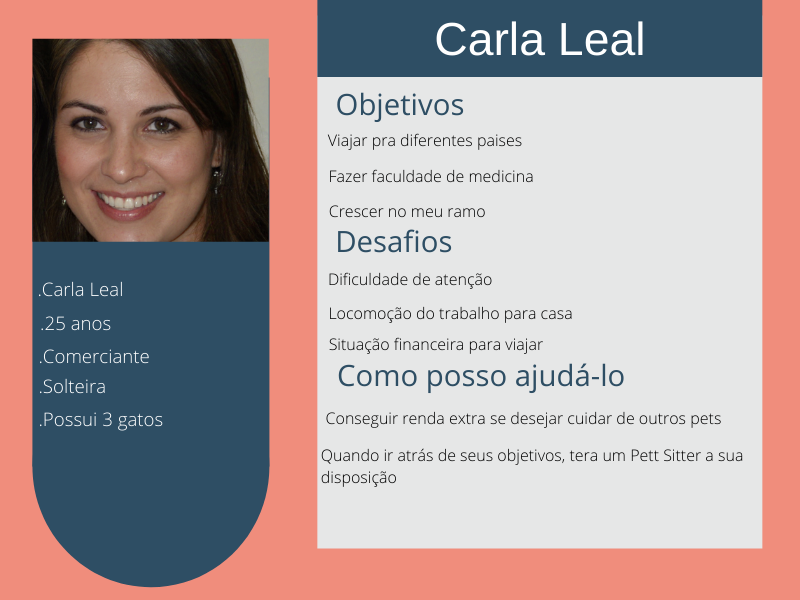

# Informações do Projeto
`PetFriends Cuidadores de Pets`  

`Ciência da Computação` 

## Participantes

 - Gabriel da Silva Martins
 - João Bosco Chagas Panzera
 - Samuel Panzera Chagas
 - Sarah Almeida França
 - Vinícius Simões Viana

# Sumario

- [Informações do Projeto](#informações-do-projeto)
  - [Participantes](#participantes)
- [Estrutura do Documento](#estrutura-do-documento)
- [Introdução](#introdução)
  - [Problema](#problema)
  - [Objetivos](#objetivos)
  - [Justificativa](#justificativa)
  - [Público-Alvo](#público-alvo)
- [Especificações do Projeto](#especificações-do-projeto)
  - [Personas e Mapas de Empatia](#personas-e-mapas-de-empatia)
  - [Histórias de Usuários](#histórias-de-usuários)
  - [Requisitos](#requisitos)
    - [Requisitos Funcionais](#requisitos-funcionais)
    - [Requisitos não Funcionais](#requisitos-não-funcionais)
  - [Restrições](#restrições)
- [Projeto de Interface](#projeto-de-interface)
  - [User Flow](#user-flow)
  - [Wireframes](#wireframes)
- [Metodologia](#metodologia)
  - [Divisão de Papéis](#divisão-de-papéis)
  - [Ferramentas](#ferramentas)
  - [Controle de Versão](#controle-de-versão)
- [**############## SPRINT 1 ACABA AQUI #############**](#-sprint-1-acaba-aqui-)
- [Projeto da Solução](#projeto-da-solução)
  - [Tecnologias Utilizadas](#tecnologias-utilizadas)
  - [Arquitetura da solução](#arquitetura-da-solução)
- [Avaliação da Aplicação](#avaliação-da-aplicação)
  - [Plano de Testes](#plano-de-testes)
  - [Ferramentas de Testes (Opcional)](#ferramentas-de-testes-opcional)
  - [Registros de Testes](#registros-de-testes)
- [Referências](#referências)

#Informações sobre o projeto

O projeto surgiu por meio de um problema comum a donos de pet: a dificulade de ter econtrar uma pessoa que possa cuidar de seu pet, enquanto o dono não pode por estiar fora de casa devido contexo ou situação. Assim para estudar e explorar mais esse problema construimos a matriz CSD, entrevistas com um publico variado (donos e não donos de pet , pessoas que trabalham oferecendo serviços pet, desevolvemos personas que compartilhavam o iteresse de ter mais opçoes de serviço para cuidados pet e assim criamos a nossa plataforma Pet Friends focada nesse sgmento com proposito de multiplicar a oferta de serviços para pet , conectar clientes com colaboradoes , gerar empregos e ampliar e diversificar as opções disponiveis desses serviços. 

# Introdução

   O mundo está mudando e as nossas necessidades também. 
   Ao olhar para trás, o tempo de pandemia, vemos que as pessoas ao se sentirem só e isoladas recorreram à adoção de pets! Uma pesquisa feita por Doghero e Petlovers mostra que cerca de 54% da população brasileira adotou algum tipo de pet durante o tempo de pandemia. Porém, agora que o cotidiano está voltando a ser agitado como antes, o tempo que levamos fora de casa voltou a crescer e o tempo para ficar em casa com nossos bichinhos, a diminuir. 
Visando ajudar os donos a ficarem mais despreocupados com seus pets ficando sozinhos, nós começamos um projeto para conectarmos vocês, donos de pets, com pessoas que amam cuidar de pets e estão esperando seu chamado para atender em sua porta! 
   Nossa plataforma servirá como uma ponte para vocês usuários, facilitando o contato entre donos de pet e cuidadores! 
Você passa tempo demais fora de casa, por qualquer que seja o motivo e se preocupa em deixar seu pet sozinho? Agora basta se tornar um -usuário- e te ajudaremos a encontrar o cuidador mais carinhoso perto de você!  
   Sabe aquela viagem que você quer fazer mas não pode deixar seu animalzinho em casa sozinho?  Problema resolvido!

## Problema

Pesquisas têm mostrado um aumento do número de brasileiros contratando serviços pets, dos mais diferentes tipos, em sites e aplicativos digitais. Pode se observar pelas pesquisas que esse Mercado cresce a cada ano e pelo comportamento do consumidor moderno que têm voltado a sua atenção para a valorização do bem estar, e conforto se seu pets. Novas opções de serviços para esse nincho têm surgido inclusive o de Pet Sitter e de hospedagem. Um problema comum na vida de donos de pets é a difilculdade de onde e com quem deixar o seu pet sob cuidados, em razão de necessidade enquanto estiver fora. Os motivos podem ser dos mais variados : viagem de férias, viagem a trabalho, compromissos agendados, emergências…  

A dificuldade de encontrar pessoas qualificadas e confiáveis para cuidar do pet, comprometendo a garantir a preservação física e mental do animal, quanto aos cuidados básicos (alimentação,  carinho, banho e tosa ,entretenimento) e especializados  (atividade física, medicação controlada, alimentação restritiva…) coisas que são de fato importante para casa dono de pet, têm tonado-se um preocupação crescente. Outras dificuldades se apresentam, como a de encontrar: cuidadores próximos a região que o dono mora, encontrar cuidadores nas datas específicas ( temporada de férias), oferta de cuidadores disponíveis em circunstâncias emergenciais, cuidadores qualificados para cuidar de cães com necessidades especiais ( paralítico, cegos, surdos,diabéticos, e  problemas cardíacos).  

Apresentados o problemas , analisamos possíveis soluções a fim de facilitar a conexão entre cliente e colabores tornando a experiência dos usuário e dos prestador de serviços melhor.   

## Objetivos

Desta forma, nós propomos uma site em que donos de pets e cuidadores poderão se encontrar de forma efetiva, o nosso trabalho procura realizar uma conexão entre os 2 usuários. Nessa plataforma, os donos solicitaram os serviços que desejam e os cuidadores terão as oportunidades que desejam. Aqui, em Pets Friends, os donos encontrarão pessoas qualificadas e confiáveis que olharão seus pets com os devidos cuidados e os cuidadores poderão realizar quais serviços se interessarem em torno de sua própria disponibilidade.

## Justificativa

O que foi essencial para o compreendimento e realização desse projeto foi entender a necessidade das pessoas em questão de custo e conforto do seu PET transformando em uma opção viavel, rapida e confiavel além também da alternativa de uma pessoa ter uma renda extra realizando serviços de cuidados PETs sem necessariamente ter a estrutura de um hotel de PET em casa, pensando também em publicos que precisam de deixar seu PET na casa de alguem ou precisar de cuidados em sua propria casa em compromissos que por exemplo, demandam viagem de ultima hora ou programada.  Com base nas pesquisas realizadas pelo proprio grupo foi confirmado toda a teoria por trás e a necessidade de se conectar com 2 publicos, aqueles que vão prestar o serviço e aqueles que vão contratar o serviço e aproximadamente 72% dos entrevistados preferem a visita de um PettSiter em sua casa devido ao conforto ja oferecido e por ja estar acostumado a tal ambiente

## Público-Alvo

O público-alvo de nosso projeto será algo bem abrangente em vários aspectos, na parte dos cliente que irão procurar o serviço será
pessoas que possuem pet, mais especificamente cães e gatos, temos que ter em mente que poderá ser pessoas de várias faixas etárias, 
escolaridades diversas, faixa de renda também não definida pois não é um serviço muito caro (tendo em vista o caso médio, onde o 
cliente não precisa do serviço casualmente), classe socialtambém diversa pois vemos uma quantidade de pessoas com pet enorme 
independente da classe social, localização será mais focada em residentes em capitais e regiões metropolitanas. Na parte dos prestadores
de serviço, a faixa etária será pessoas maiores de 18 anos, escolaridades diversas, faixa de renda irrelevante também, visto que nosso 
projeto poderá também ser uma forma de renda para muitas pessoas, localização igual a de nossos clientes.

 
# Especificações do Projeto

......  COLOQUE AQUI O SEU TEXTO ......

> Apresente uma visão geral do que será abordado nesta parte do
> documento, enumerando as técnicas e/ou ferramentas utilizadas para
> realizar a especificações do projeto

## Personas e Mapas de Empatia

**TODAS AS PERSONAS FORAM CRIADAS A PARTIR DE ALGORITIMOS, PORTANTO NÃO EXISTE ESTAS PESSOAS,  QUALQUER SEMELHANÇA É MERA COINCIDENCIA**

## Histórias de Usuários

-------------------------------------------------------------------------------------------------------
|  Eu como 'persona'... |           quero/preciso...          |           para que/pois...             |
|-----------------------|-------------------------------------|----------------------------------------|
|     Martha Alves      | um cuidador que fique 1 final de    | possa relaxar e utilizar o tempo livre |
|                       | semana por mês cuidando de seu pet  | para aprender novas coisas             |
|-----------------------|-------------------------------------|----------------------------------------|
|      Carla Leal       | um cuidador e veterinário tendo     | poder ir trabalhar tranquila sabendo   |
|                       | experiência com surto de epilepsia  | que o pet está tendo companhia e sendo |
|                       |                                     | bem tratado                            |
|-----------------------|-------------------------------------|----------------------------------------|
|      Pedro Costa      | um cuidador que fique cuidando de   | poder sair mais com os amigos          |
|                       | seus pets                           |                                        |
|-----------------------|-------------------------------------|----------------------------------------|
|    Helena Medeiros    | ganhar um dinheiro extra fazendo um | diminua a preocupação com questão      | 
|                       | trabalho que já está acostumada a   | financeira                             |
|                       | realizar                            |                                        |
|-----------------------|-------------------------------------|----------------------------------------|
|   Roberta Oliveira    | ter mais trabalho cuidando de pets  | ajudar os pets e ter mais experiência  |
--------------------------------------------------------------------------------------------------------

## Requisitos

As tabelas que se seguem apresentam os requisitos funcionais e não funcionais que detalham o escopo do projeto.

### Requisitos Funcionais
------------------------------------------------------------------
|ID    | Descrição do Requisito                      | Prioridade |
|------|---------------------------------------------|------------|
|RF-001| Cadastro de Usuário                         | ALTA       | 
|RF-002| Cadastros de Colaboradores                  | ALTA       |
|RF-003| Cadastro de Pedido                          | ALTA       |
|RF-004| Login Usuário                               | ALTA       |
|RF-005| Login Colaborador                           | ALTA       |
|RF-006| Sistema de Busca de Pet Sitter e Hospedagem | ALTA       |
|RF-007| Armazenamento de dados por web Local Storage| ALTA       |
|RF-008| Perfil Usuário                              | ALTA       |
|RF-009| Perfil Pet Sitter                           | ALTA       |
|RF-010| Perfil de Anfitrião                         | ALTA       |
------------------------------------------------------------------

### Requisitos não Funcionais
------------------------------------------------------------------
|ID     | Descrição do Requisito                     | Prioridade |
|-------|--------------------------------------------|------------|
|RNF-001| O sistema deve ser responsivo para rodar em| ALTA       |
|       | um dispositivos móveis                     |            |
|RNF-002| Sistema deve ser multiplataforma           | ALTA       |
|       | (Windows/Linux/etc)                        |            |
|RNF-003| Seleção e introdução de serviços na        | ALTA       |
|       | página inicial                             |            |
|RNF-004| Sistema de desativação de conta (exceto    | ALTA       |
|       | donos de pet) por inatividade após         |            |
|       | [3] meses sem uso                          | ALTA       |
|RNF-005| Disponibilidade para os usuários           | ALTA       |
|       | customizarem os seus perfis a              |            |
|       | qualquer momento                           |            |
|RNF-006| Padronização das cores do site             | MÉDIA      |
|RNF-007| Deve processar requisições do usuário em   | MÉDIA      |
|       | no máximo 3s                               |            |
|RNF-008| Limitar tempo máximo de resposta do site   | MÉDIA      |
|       | (120s) antes de pedir para atualizar a     |            |
|       | página novamente                           |            |
|RNF-009| Histórico de serviços anteriores           | MÉDIA      | 
|       | (Cuidadores que já presteram serviço)      |            |
|RNF-010| Calcular automaticamente o valor           | MÉDIA      |
|       | recomendado pelo serviço, com os dados do  |            |
|       | tamanho, quantidade e necessidades do pet  |            |
|RNF-011| Verificação e confirmação mensal pessoais  | MÉDIA      |
|       | do usuário e dos colaboradores             |            |
|RNF-012| Fixar o HUD superior com atalhos e campo   | BAIXA      |
|       | de busca                                   |            |
|RNF-013| Processar login dos usuários em menos de 5s| BAIXA      |
------------------------------------------------------------------

## Restrições

O projeto está restrito pelos itens apresentados na tabela a seguir.
----------------------------------------------------------------
|ID| Restrição                                                  |
|--|------------------------------------------------------------|    
|01| O projeto deverá ser entregue até o final do semestre      |
|02| Não pode ser desenvolvido um módulo de backend             |
|03| Não é possível monitorar usuários reais e fakes            |
|04| Linguagem do site Português                                |
|05| Serviço restrito a região metropolitana de Belo Horizonte  |
|06| Necessário o conexão com internet                          |
|07| Restringindo a dispositivos desktop e mobile               |
-----------------------------------------------------------------

# Projeto de Interface

......  COLOQUE AQUI O SEU TEXTO DE INTRODUÇÃO ......

> Apresente as principais interfaces da solução. Discuta como 
> foram elaboradas de forma a atender os requisitos funcionais, não
> funcionais e histórias de usuário abordados nas [Especificações do
> Projeto](#especificações-do-projeto).

## User Flow

## Wireframes

......  INCLUA AQUI OS WIREFRAMES DAS TELAS DA APLICAÇÃO COM UM BREVE DESCRITIVO ......

> Wireframes são protótipos das telas da aplicação usados em design de interface para sugerir a
> estrutura de um site web e seu relacionamentos entre suas
> páginas. Um wireframe web é uma ilustração semelhante ao
> layout de elementos fundamentais na interface.
> 
> **Links Úteis**:
> - [Ferramentas de Wireframes](https://rockcontent.com/blog/wireframes/)
> - [Figma](https://www.figma.com/)
> - [Adobe XD](https://www.adobe.com/br/products/xd.html#scroll)
> - [MarvelApp](https://marvelapp.com/developers/documentation/tutorials/)
> 
> **Exemplo**:
> 
> 
[Wireframes.pdf](https://github.com/ICEI-PUC-Minas-PMGCC-TI/tiaw-pmg-cc-m-20221-tiaw-cuidadores-de-pets-grupo-5/files/8502731/Wireframes.pdf)

Tela 1 - Tela Inicial de Apresetação do Site Pet Frieds 
Tela 2 - Tela Pesquisa Pett Sitter (Cuidador pet)
Tela 3 - Tela Pesquisa Hospedagem (Anfitrião Pet)
Tela 4 - Tela Perfil Pet Sitter (Cuidador pet)
Tela 5 - Tela Formulário solicitaçãode Serviço
Tela 6 - Tela Perfil Pet (cachorro/Gato)

# Metodologia

  O processo de desenvolvimento das ideias do projeto foi baseado em em uma reunião na sala onde foi discutido as ideias iniciais associadas ao tema, dentre os principais problemas as dores do publico-alvo e como o projeto poderia ajudar nos problemas, nessa etapa foi discutida informações sobre o entendimento do assunto e como poderíamos relacionar isso a um projeto maior e funcional e sobre os problemas de projeto que serão enfrentados mais a frente, além também da forma como iríamos reunir e adaptar isso na metodologia agil do Scrum, as reuniões diarias e semanais foram combinadas através da ferramenta “discord”, unindo o grupo e discutindo os temas apresentados alem da realização do “Brainwriting” pelo Miro (que é a forma como ideias são apresentadas e aprimoradas pelo grupo), dessa forma conseguimos unir as informações e separar as demandas para os indivíduos através de grupo no Whatsapp, ferramenta “docs” para a realização das pesquisas e também da plataforma “Trello” para o entendimento de quais partes estavam pendentes, separação de demandas e controle de informações. Para ter certeza de todos os assuntos discutidos dentro de aula e devido a conflitos de ideias foi realizada a pesquisa para ter certeza sobre o caminhar do projeto e que seria implementado de acordo com a necessidade do publico.

  O GitHub foi configurado para a etapa de desenvolvimento que permite a realização de etapas de teste, desenvolvimento, versões instáveis para que depois possa ser implementada no “Master” onde será responsável por atualizações no projeto final e toda estrutura base que será enviada para o hosting. 

   O Hosting escolhido GitHub Pages pela forma facil e simples de ser implementada através do repositorio, as faceis atualizações interligadas também ao repositorio e todas as ferramentas contidas.

 
 
## Divisão de Papéis

### Documentação
 - introdução: Vinícius Simões Viana
 - Problemas:  Gabriel da Silva Martins
 - Objetivos:  Sarah Almeida França
 - Justificativa: Samuel Panzera Chagas
 - Publico-alvo: João Bosco Chagas Panzera

### Especificações do projeto 
 - Personas e mapas de empatia:  Samuel Panzera Chagas
 - Historias de Usuarios: Sarah Almeida França
  - Requisitos Funcionais:  Gabriel da Silva Martins
  - Requisitos não funcionais:  Vinícius Simões Viana
 - Restrições:   Gabriel da Silva Martins

### Projeto de interface
- User Flow: João Bosco Chagas Panzera
- Wireframes: Gabriel da Silva Martins e Vinícius Simões Viana

### Metodologia 
- Resumo e Ferramentas: Samuel Panzera Chagas
- Divisão de papeis: Vinícius Simões Viana
- Controle de versão: Samuel Panzera Chagas

### Matriz CSD; entrevistas; criação de personas/mapa de empatia(MIRO):

Gabriel da Silva Martins, João Bosco Chagas Panzera, Samuel Panzera Chagas,  Sarah Almeida França, Vinícius Simões Viana

## Ferramentas

| Ambiente  | Plataforma              |Link de Acesso |
|-----------|-------------------------|---------------|
|Processo de Design Thinkgin  | Miro |  https://miro.com/app/board/uXjVOB6EDa8=/ | 
|Repositório de código | GitHub | https://github.com/ICEI-PUC-Minas-PMGCC-TI/tiaw-pmg-cc-m-20221-tiaw-cuidadores-de-pets-grupo-5 | 
|Hospedagem do site | GitHub Pages |  https://icei-puc-minas-pmgcc-ti.github.io/tiaw-pmg-cc-m-20221-tiaw-cuidadores-de-pets-grupo-5/ | 
|Protótipo Interativo | Figma | https://www.figma.com/file/RgngHnrjgzD5h9qhmV7TNs/Wireframes?node-id=32%3A5 | 
|Organização de tarefas | Trello | https://trello.com/b/dm7YJpHc/cuidadores-de-pets | 

> As ferramentas empregadas no projeto são:
> 
 - Visual Studio Code  
Ferramenta escolhida pela familiaridade da equipe em resolver problemas de codigo nessa plataforma,  também por ser a principal ferramenta de trabalho do mercado hoje em dia. 
 - Discord  
Foi escolhido devido a organização de Chat, Prints, e possibilidade de reuniões diarias.  
 - Figma  
Facil organização e implementação da parte visual de forma a entender melhor como sera colocado no projeto  
 - GitHub Pages  
Facilidade de comunicação com o github e com o repositorio para o envio instataneo de uma atualização no projeto

## Controle de Versão

Controle foi feito a partir de 4 Branchs e 3 tags (relases) para o apontamento correto de erros
As issues serão tratadas a partir de numeros gerados em ordem (ex: #001,#002), será   
identificado para correção de eventuais problemas e será discutidas nas reuniões usando  
as metodologias Scrum.
Serão 4 Branches dentre as quais: 
 
 - `master`: versão estável já testada do software
 - `unstable`: versão já testada do software, porém instável
 - `testing`: versão em testes do software
 - `dev`: versão de desenvolvimento do software

 Quanto à gerência de issues, o projeto adota a seguinte convenção para
etiquetas (conforme padronização do curso):
> 
 - `bugfix`: uma funcionalidade encontra-se com problemas
 - `enhancement`: uma funcionalidade precisa ser melhorada
 - `feature`: uma nova funcionalidade precisa ser introduzida

 

# **############## SPRINT 1 ACABA AQUI #############**

# Projeto da Solução

......  COLOQUE AQUI O SEU TEXTO ......

## Tecnologias Utilizadas

......  COLOQUE AQUI O SEU TEXTO ......

> Descreva aqui qual(is) tecnologias você vai usar para resolver o seu
> problema, ou seja, implementar a sua solução. Liste todas as
> tecnologias envolvidas, linguagens a serem utilizadas, serviços web,
> frameworks, bibliotecas, IDEs de desenvolvimento, e ferramentas.
> Apresente também uma figura explicando como as tecnologias estão
> relacionadas ou como uma interação do usuário com o sistema vai ser
> conduzida, por onde ela passa até retornar uma resposta ao usuário.
> 
> Inclua os diagramas de User Flow, esboços criados pelo grupo
> (stoyboards), além dos protótipos de telas (wireframes). Descreva cada
> item textualmente comentando e complementando o que está apresentado
> nas imagens.

## Arquitetura da solução

......  COLOQUE AQUI O SEU TEXTO E O DIAGRAMA DE ARQUITETURA .......

> Inclua um diagrama da solução e descreva os módulos e as tecnologias
> que fazem parte da solução. Discorra sobre o diagrama.
> 
> **Exemplo do diagrama de Arquitetura**:
> 
> 

# Avaliação da Aplicação

......  COLOQUE AQUI O SEU TEXTO ......

> Apresente os cenários de testes utilizados na realização dos testes da
> sua aplicação. Escolha cenários de testes que demonstrem os requisitos
> sendo satisfeitos.

## Plano de Testes

......  COLOQUE AQUI O SEU TEXTO ......

> Enumere quais cenários de testes foram selecionados para teste. Neste
> tópico o grupo deve detalhar quais funcionalidades avaliadas, o grupo
> de usuários que foi escolhido para participar do teste e as
> ferramentas utilizadas.
> 
> **Links Úteis**:
> - [IBM - Criação e Geração de Planos de Teste](https://www.ibm.com/developerworks/br/local/rational/criacao_geracao_planos_testes_software/index.html)
> - [Práticas e Técnicas de Testes Ágeis](http://assiste.serpro.gov.br/serproagil/Apresenta/slides.pdf)
> -  [Teste de Software: Conceitos e tipos de testes](https://blog.onedaytesting.com.br/teste-de-software/)

## Ferramentas de Testes (Opcional)

......  COLOQUE AQUI O SEU TEXTO ......

> Comente sobre as ferramentas de testes utilizadas.
> 
> **Links Úteis**:
> - [Ferramentas de Test para Java Script](https://geekflare.com/javascript-unit-testing/)
> - [UX Tools](https://uxdesign.cc/ux-user-research-and-user-testing-tools-2d339d379dc7)

## Registros de Testes

......  COLOQUE AQUI O SEU TEXTO ......

> Discorra sobre os resultados do teste. Ressaltando pontos fortes e
> fracos identificados na solução. Comente como o grupo pretende atacar
> esses pontos nas próximas iterações. Apresente as falhas detectadas e
> as melhorias geradas a partir dos resultados obtidos nos testes.

# Referências

......  COLOQUE AQUI O SEU TEXTO ......

> Inclua todas as referências (livros, artigos, sites, etc) utilizados
> no desenvolvimento do trabalho.
> 
> **Links Úteis**:
> - [Formato ABNT](https://www.normastecnicas.com/abnt/trabalhos-academicos/referencias/)
> - [Referências Bibliográficas da ABNT](https://comunidade.rockcontent.com/referencia-bibliografica-abnt/)
